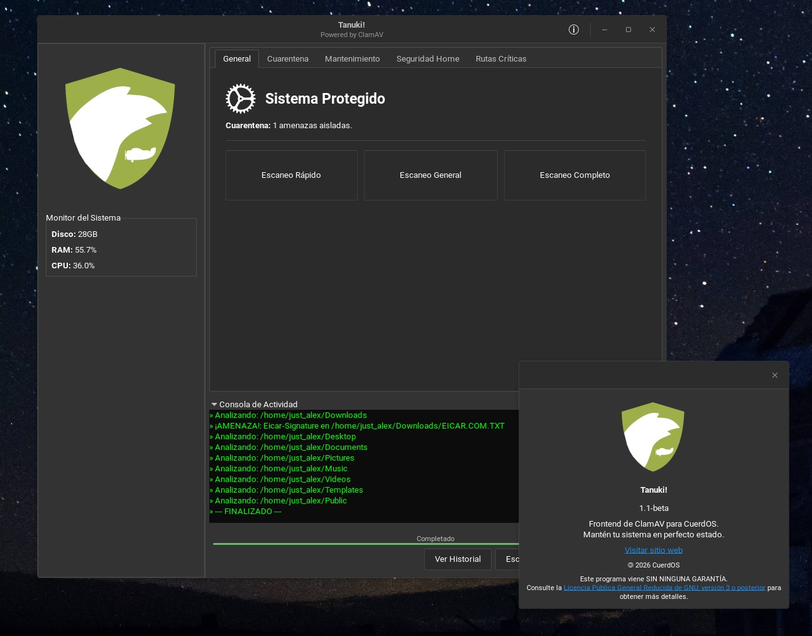

# Tanuki! for CuerdOS (Discontinued)

<p align="center">
  
</p>



## What is **Tanuki!**?

**Tanuki!** is a health and security control center designed to simplify the maintenance of **Linux** systems. It acts as an intuitive graphical interface for **ClamAV**, allowing you to perform malware scans, manage quarantined files, and update virus signatures without using the command line at all.

## Characteristics
- **User-friendly graphical interface**
- **Fast and lightweight**
- **Comes with an installer**
- **Doesn't need the terminal**

## How does it work?

**Tanuki!** works as an intelligence hub that orchestrates the most powerful **Linux** tools under an intuitive interface. Using **Python**, the program communicates directly with the **ClamAV** engine to perform deep malware scans, isolating threats in an inert quarantine through system-level permission changes. Simultaneously, it automates equipment maintenance by generating dynamic **Bash** scripts that clean up residual files and logs with administrator privileges.

## Requirements
- Python3.x
- PyGObject
- GTK 3
- ClamAV
- PyClamd
- ClamAV-daemon

## Instalation
Clone the repository and run the app:

```bash
git clone https://github.com/Just-Alex22/Tanuki.git
cd Tanuki
python3 installer.py # installs dependecies
python3 tanuki!.py 

```
## Contributing
If you want to contribute with the development of **Tanuki!**, follow us on github send your **Pull Requests** and **Issues** through the repository

## Licence
This program comes with the GNU LGPLv3 licence, consult https://www.gnu.org/licenses/lgpl-3.0.html for more information.

---

> **Maintainer** [Just_Alex](https://github.com/Just-Alex22)
> **Repository:** [ConkyMan](https://github.com/Just-Alex22/ConkyMan)
