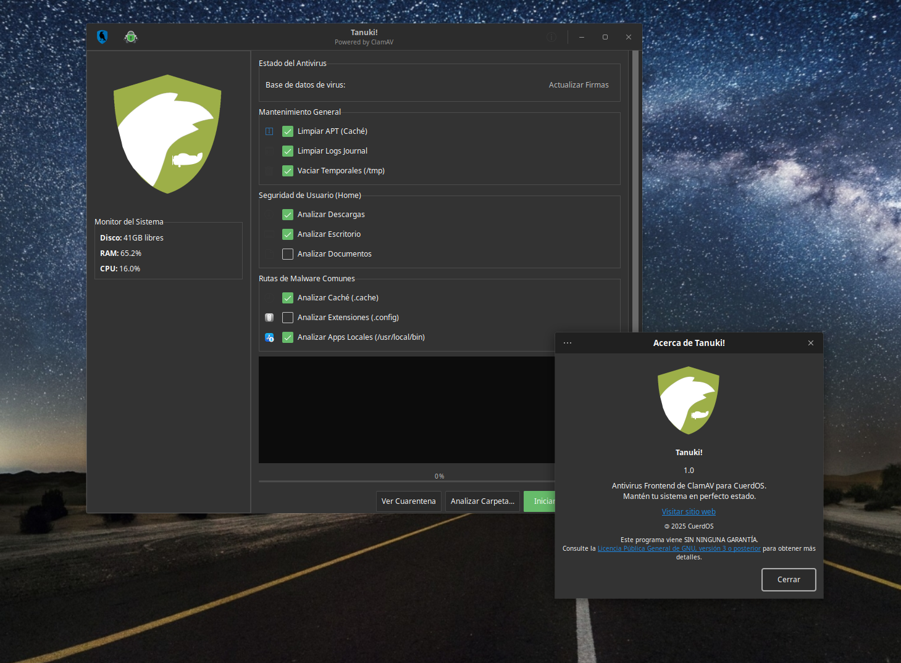

# Tanuki! for CuerdOS

Tanuki! is a health and security control center designed to simplify the maintenance of Linux systems. It acts as an intuitive graphical interface for ClamAV, allowing you to perform malware scans, manage quarantined files, and update virus signatures without using the command line.

## How does it work?

Tanuki! works by acting as an intermediary between the user and ClamAV. The user first selects which tasks ClamAV is going to perform, then Tanuki! tells ClamAV and other components what they need to do.

## Installation

First, copy Tanuki's repository via `git clone`, then run `installer.py`  to install all necessary dependencies, and you are ready to go!

## Copyright

@2026 CuerdOS Dev Team, This program comes with the GNU LGPLv3 licence, consult https://www.gnu.org/licenses/lgpl-3.0.html for more 
information.

## Screenshot

